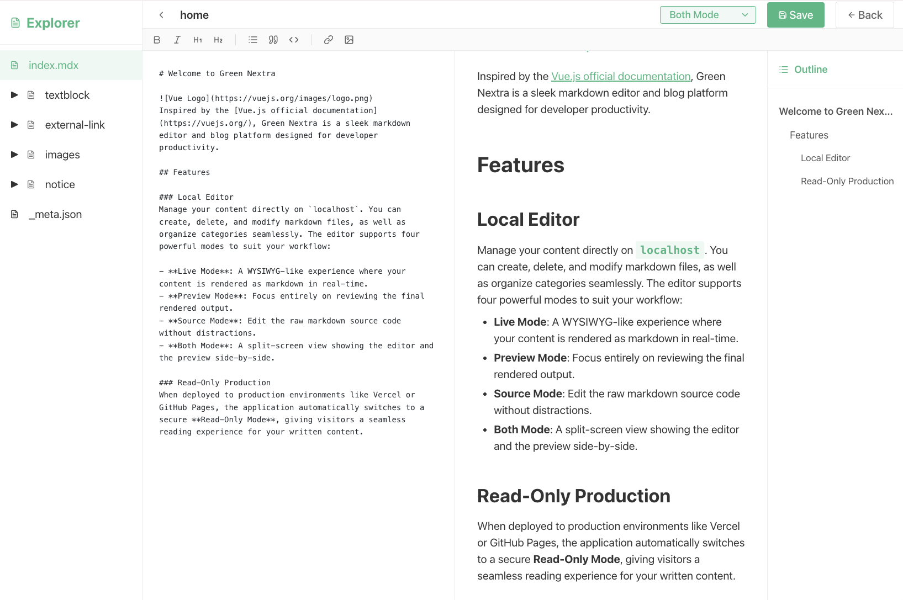

# Green Nextra Markdown Editor


<br/>
<br/>

안녕하세요. 이 프로젝트는 로컬호스트에서 브라우저를 통해 현재 리포지터리의 마크다운을 작성,수정,삭제하거나 카테고리들을 수정하고, vercel 이나 github.io 또는 별도의 호스팅으로 production 환경으로 배포 시 이 리포지터리를 디렉터리 구조로 마크다운을 확인할 수 있도록 하는 프로젝트입니다.<br/>

데모는 https://green-nextra-markdown-editor.vercel.app/ 에 있으니 확인해주시면 됩니다.<br/>
<br/>

강의 필기를 한다거나, 어떤 책을 읽은 내용들을 정리하거나, 유튜브 경제 방송등을 들을 때 캡쳐 이미지를 드래그앤 드랍으로 추가하거나 Youtube 링크를 추가할 때 Preview 기능이 지원되면 좋다는 생각을 하기도 했었고, Terraform 강의 필기를 하다가 필기가 점점 쌓여가다보니 정리가 필요해서 내가 사용하기 위한 목적으로 이 프로젝트를 개설해서 본격적으로 진행하게 되었고 그 결과 이 프로젝트가 탄생하게 되었네요.✨✨<br/>
<br/>


처음 시작할 때는 Nextra 와 StackEdit 의 기능이 혼합된 도구를 만들고 싶어서 시작하게 되었는데, 현재 마크다운으로 뭔가를 수정해서 보관하는 서비스는 있지만, 지나치게 공감을 받는다거나 트렌딩에 오른다거나 하는 불안감 때문에 공개하기 꺼려지는 경우도 있다는 생각도 들었습니다. 이 프로젝트는 개인적으로 뭔가를 기록하거나 메모하거나 한 내용들을 github repository 를 통해 로컬에서도 확인할 수 있고, vercel, github.io 등을 이용해서도 production 으로 배포해서 강의 노트나 일상생활 속에서 필기한 내용들, 스크랩한 내용 등을 지인들에게 공유할 수 있도록 하는 목적에 조금 더 부합하는 것 같습니다. 라이선스는 nextra 의 라이선스를 그대로 따르지만, 저 조차도 nextra 의 라이선스가 어떤지는 잘 모릅니다. 그냥 누구든지 자유롭게 사용하시거나 입맛에 맞도록 수정해서 사용하시면 됩니다.<br/>
<br/>
<br/>


# 사용법
사용법은 간단합니다. 현재 Repository 를 Clone 해서 사용한다면 다음과 같이 해주세요.
```bash
git clone https://github.com/alpha3002025/green-nextra-markdown-editor.git [원하는 프로젝트 명]

cd [원하는 프로젝트 명]

rm -rf .git

npm install

npm run dev
```
<br/>

zip 파일로 다운 받았을 경우 다음과 같이 진행하시면 됩니다.
```bash
unzip green-nextra-markdown-editor.zip

cd green-nextra-markdown-editor

npm install

npm run dev
```
<br/>
<br/>


# 에디터 사용법
다음 화면은 '뷰어 화면'이라고 부릅니다. '뷰어 화면'의 우측 하단의 연필 버튼을 클릭하세요.

<br/>
<br/>


상단의 셀렉트 메뉴에서 `Both Mode` 를 선택하면 글 작성과 미리보기를 함께 수행할 수 있습니다. 

<br/>
<br/>

좌측 Explorer 패널에서는 현재 프로젝트 디렉터리 내에서 파일들의 디렉터리 배치를 수정할 수 있습니다. `_meta.json` 파일에서 디렉터리를 뷰어에서 어떤 제목으로 보이게 할지와 각 파일들의 노출 순서를 바꿀수 있습니다.<br/>
<br/>


```json
{
  "index": "Home 🏁",
  "textblock": "text block, code block, paragrah",
  "external-link": "external link",
  "images": "Images",
  "notice": "notice 📣"
}
```
<br/>


예를 들어 위의 파일의 경우 프로젝트 루트의 `/_meta.json` 파일입니다. index 라는 이름은 현재 `_meta.json` 파일이 위치한 디렉터리 내의 `index.md` 파일을 의미합니다. 이 `index.md` 파일은 위의 json 내에서 매핑한 것에 따라 좌측 사이드바 내에서 `Home 🏁`로 보이게 됩니다.<br/>

`textblock` 은 디렉터리입니다. 이 `textblock` 디렉터리는 좌측 사이드바 내에서 `text block, code block, paragrah`로 보이게 됩니다.<br/>

`external-link` 은 디렉터리입니다. 이 `external-link` 디렉터리는 좌측 사이드바 내에서 `external link`로 보이게 됩니다.<br/>

`images` 은 디렉터리입니다. 이 `images` 디렉터리는 좌측 사이드바 내에서 `Images`로 보이게 됩니다.<br/>

`notice` 은 디렉터리입니다. 이 `notice` 디렉터리는 좌측 사이드바 내에서 `notice 📣`로 보이게 됩니다.<br/>
<br/>

각각의 디렉터리 내에는 또 다시 `_meta.json` 파일이 있습니다. 이 `_meta.json` 각 디렉터리 마다 보여줄 파일들의 노출 순서, 노출 명 등을 지정할 수 있습니다.<br/>
<br/>
