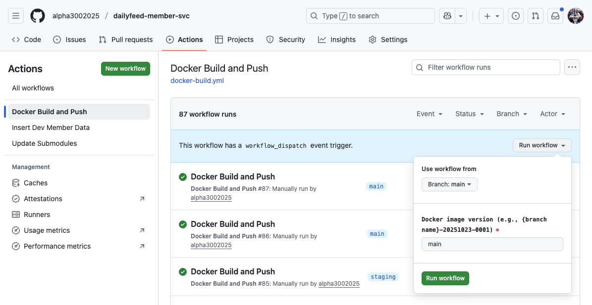
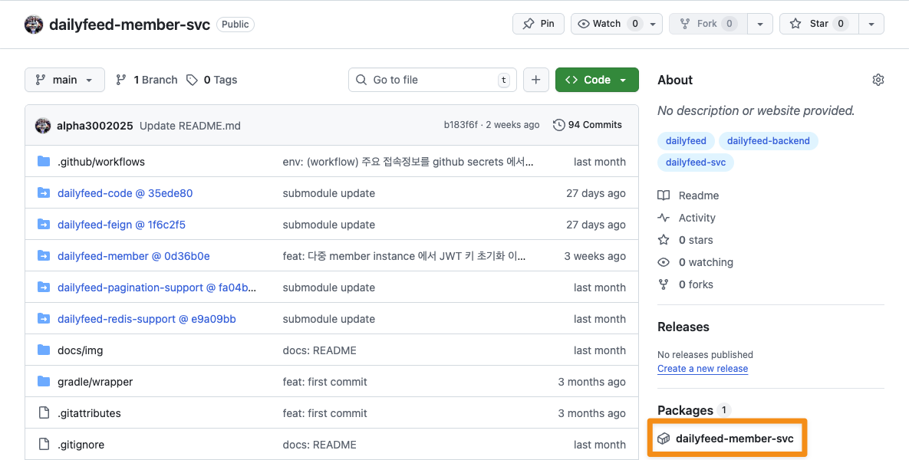
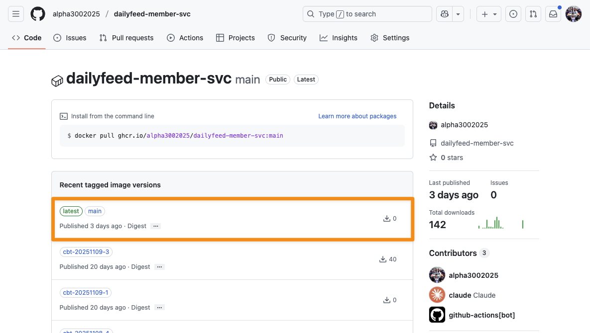
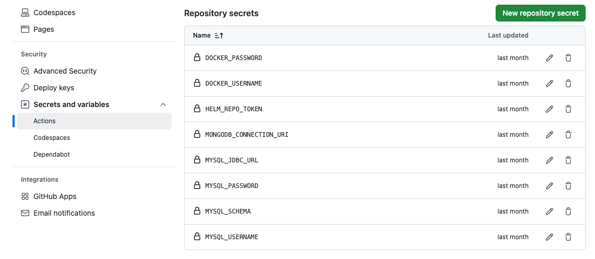

# docker image 빌드를 github workflow 로 정의

'dailyfeed' 프로젝트 내의 모든 서비스 프로젝트는 github workflow 기능을 통해 docker image 빌드를 수행할 수 있도록 했습니다. 각각의 docker build 를 수행하는 github action 페이지 들은 다음과 같습니다.
- [dailyfeed-frontend-svc/docker-build.yml](https://github.com/alpha3002025/dailyfeed-frontend-svc/actions/workflows/docker-build.yml)
- [dailyfeed-member-svc/docker-build.yml](https://github.com/alpha3002025/dailyfeed-member-svc/actions/workflows/docker-build.yml)
- [dailyfeed-content-svc/docker-build.yml](https://github.com/alpha3002025/dailyfeed-content-svc/actions/workflows/docker-build.yml)
- [dailyfeed-timeline-svc/docker-build.yml](https://github.com/alpha3002025/dailyfeed-timeline-svc/actions/workflows/docker-build.yml)
- [dailyfeed-search-svc/docker-build.yml](https://github.com/alpha3002025/dailyfeed-search-svc/actions/workflows/docker-build.yml)
- [dailyfeed-image-svc/docker-build.yml](https://github.com/alpha3002025/dailyfeed-image-svc/actions/workflows/docker-build.yml)
- [dailyfeed-activity-svc/docker-build.yml](https://github.com/alpha3002025/dailyfeed-activity-svc/actions/workflows/docker-build.yml) 
- [dailyfeed-batch-svc/docker-build.yml](https://github.com/alpha3002025/dailyfeed-batch-svc/actions/workflows/docker-build.yml)
<br/>
<br/>

## docker build 를 repository 내의 Actions 메뉴에서
초기 개발 시에는 `jibDockerBuild.sh`를 터미널에서 실행해서 빌드하고 push 했었습니다. 그런데 이게 시간이 지날수록 복잡해지기도 하고 언제 이미지를 빌드했는지도 기억이 안날 때도 있었고, 이 프로젝트를 clone 받는 사람에게 이미지를 빌드할 수 있는 방법에 대해 쉽게 알려줄 방법이 필요하다고 생각했습니다. 이런 이유로 github actions 를 사용하게 되었습니다.<br/>



<br/>

github reposotiry 페이지 ➝ `Actions` 탭 ➝ `Docker Build and Push` 메뉴로 진입해서 build 하려는 브랜치를 선택하고, 해당 브랜치를 어떤 이미지 명으로 빌드할지 입력합니다. 그리고 `Run workflow` 버튼을 클릭하며 이미지 빌드가 시작됩니다.<br/>
<br/>


## docker 이미지 확인
빌드된 이미지는 `ghcr.io` 내에서 확인할 수 있습니다. github repository 내에서 이미지를 확인하는 방법은 다음과 같습니다.<br/>
<br/>

Github Repository 로 진입 후에 우측 사이드 메뉴 내에서 `Packages` 라는 배너 아래에는 프로젝트에 대한 패키지 링크가 표시되는데 (위 그림에서 주황색 영역으로 표시) 이 링크를 클릭해서 해당 docker image 페이지로 넘어갑니다.<br/>


<br/>
<br/>

docker 이미지 페이지로 이동하면 다음과 같이 방금 전에 빌드된 이미지를 확인하실 수 있습니다.<br/>


<br/>
<br/>

## workflow yaml
### 백엔드 서비스 workflow yaml
아래 파일은 `dailyfeed-member-svc` 를 github workflow 를 이용해 docker image 빌드를 수행하는 yaml 파일입니다. 다른 백엔드 서비스들의 workflow 파일들 모두 비슷한 구조를 띄고 있습니다. <br/>
`docker-build.yaml`
```yaml
name: Docker Build and Push

on:
  workflow_dispatch:
    inputs:
      image_version:
        description: 'Docker image version (e.g., {branch name}-20251023-0001)'
        required: true
        type: string

env:
  # 기본 이미지 버전 (자동 생성)
  DEFAULT_IMAGE_VERSION: ${{ github.ref_name }}-${{ github.run_number }}

jobs:
  build-and-push:
    runs-on: ubuntu-latest
    permissions:
      contents: read
      packages: write

    # GitHub Environment를 사용하는 경우 (권장)
    # environment: production

    steps:
      - name: Checkout code
        uses: actions/checkout@v4
        with:
          submodules: recursive

      - name: Set up JDK 17
        uses: actions/setup-java@v4
        with:
          java-version: '17'
          distribution: 'temurin'

      - name: Setup Gradle
        uses: gradle/actions/setup-gradle@v3

      - name: Determine Image Version
        id: version
        run: |
          if [ "${{ github.event_name }}" == "workflow_dispatch" ]; then
            echo "IMAGE_VERSION=${{ inputs.image_version }}" >> $GITHUB_ENV
          else
            # 자동 빌드 시 날짜 기반 버전 생성
            IMAGE_VERSION="${{github.ref_name}}-$(date +'%Y%m%d-%H%M')"
            echo "IMAGE_VERSION=${IMAGE_VERSION}" >> $GITHUB_ENV
          fi
          echo "Selected image version: ${IMAGE_VERSION}"

      - name: Build Project
        run: |
          ./gradlew :dailyfeed-member:build -x test --info
        env:
          MYSQL_JDBC_URL: ${{ secrets.MYSQL_JDBC_URL }}
          MYSQL_USERNAME: ${{ secrets.MYSQL_USERNAME }}
          MYSQL_PASSWORD: ${{ secrets.MYSQL_PASSWORD }}
          MYSQL_SCHEMA: ${{ secrets.MYSQL_SCHEMA }}

      - name: Build and Push Docker Image with Jib
        run: |
          ./gradlew :dailyfeed-member:jib --info
        env:
          ## (1)
          IMAGE_VERSION: ${{ env.IMAGE_VERSION }}
          GITHUB_USERNAME: ${{ github.actor }}
          GITHUB_TOKEN: ${{ secrets.GITHUB_TOKEN }}
          MYSQL_JDBC_URL: ${{ secrets.MYSQL_JDBC_URL }}
          MYSQL_USERNAME: ${{ secrets.MYSQL_USERNAME }}
          MYSQL_PASSWORD: ${{ secrets.MYSQL_PASSWORD }}
          MYSQL_SCHEMA: ${{ secrets.MYSQL_SCHEMA }}
          MONGODB_CONNECTION_URI: ${{ secrets.MONGODB_CONNECTION_URI }}

      - name: Build Summary
        run: |
          echo "### Docker Build Summary :rocket:" >> $GITHUB_STEP_SUMMARY
          echo "" >> $GITHUB_STEP_SUMMARY
          echo "- **Image**: ghcr.io/alpha3002025/dailyfeed-member-svc" >> $GITHUB_STEP_SUMMARY
          echo "- **Tag**: ${{ env.IMAGE_VERSION }}" >> $GITHUB_STEP_SUMMARY
          echo "- **Triggered by**: ${{ github.actor }}" >> $GITHUB_STEP_SUMMARY
          echo "- **Commit**: ${{ github.sha }}" >> $GITHUB_STEP_SUMMARY
```
<br/>

(1) jib build 시 github 의 `Secrets and variables`, workflow env 변수를 활용
- github 의 `Secrets and variables`기능과 workflow 시작시 정의한 workflow env 변수를 이용하는 부분입니다.
<br/>

(1) 의 내용에 대해 github repository `Secrets and variables` 내에 주요 환경변수 정의한 부분은 다음과 같습니다. 

<br/>
<br/>

### 프론트엔드 서비스 workflow yaml
아래 파일은 `dailyfeed-frontend-svc` 를 github workflow 를 이용해 docker image 빌드를 수행하는 yaml 파일입니다. frontend 의 경우 미리 정의했던 `Dockerfile` 파일을 Claude Code 를 이용해서 빌드 파일을 만들었습니다.<br/>
<br/>

`docker-build.yaml`
```yaml
name: Docker Build and Push

on:
  push:
    branches:
      - main
      - develop
      - hotfix
      - sandbox
  workflow_dispatch:
    inputs:
      image_version:
        description: 'Docker image version (e.g., {branch name}-20251023-0001)'
        required: true
        type: string

env:
  # 기본 이미지 버전 (자동 생성)
  DEFAULT_IMAGE_VERSION: ${{ github.ref_name }}-${{ github.run_number }}

jobs:
  build-and-push:
    runs-on: ubuntu-latest
    permissions:
      contents: read
      packages: write

    # GitHub Environment를 사용하는 경우 (권장)
    # environment: production

    steps:
      - name: Checkout code
        uses: actions/checkout@v4

      - name: Set up Node.js
        uses: actions/setup-node@v4
        with:
          node-version: '20'
          cache: 'npm'

      - name: Determine Image Version
        id: version
        run: |
          if [ "${{ github.event_name }}" == "workflow_dispatch" ]; then
            echo "IMAGE_VERSION=${{ inputs.image_version }}" >> $GITHUB_ENV
          else
            # 자동 빌드 시 날짜 기반 버전 생성
            IMAGE_VERSION="${{github.ref_name}}-$(date +'%Y%m%d-%H%M')"
            echo "IMAGE_VERSION=${IMAGE_VERSION}" >> $GITHUB_ENV
          fi
          echo "Selected image version: ${IMAGE_VERSION}"

      - name: Install dependencies
        run: npm ci

      - name: Build project
        run: npm run build

      - name: Log in to GitHub Container Registry
        uses: docker/login-action@v3
        with:
          registry: ghcr.io
          username: ${{ github.actor }}
          password: ${{ secrets.GITHUB_TOKEN }}

      - name: Set up Docker Buildx
        uses: docker/setup-buildx-action@v3

      - name: Build and Push Multi-Platform Docker Image
        uses: docker/build-push-action@v5
        with:
          context: .
          file: ./Dockerfile
          platforms: linux/amd64,linux/arm64
          push: true
          tags: |
            ghcr.io/alpha3002025/dailyfeed-frontend-svc:${{ env.IMAGE_VERSION }}
            ghcr.io/alpha3002025/dailyfeed-frontend-svc:latest
          cache-from: type=gha
          cache-to: type=gha,mode=max

      - name: Build Summary
        run: |
          echo "### Docker Build Summary :rocket:" >> $GITHUB_STEP_SUMMARY
          echo "" >> $GITHUB_STEP_SUMMARY
          echo "- **Image**: ghcr.io/alpha3002025/dailyfeed-frontend-svc" >> $GITHUB_STEP_SUMMARY
          echo "- **Tag**: ${{ env.IMAGE_VERSION }}" >> $GITHUB_STEP_SUMMARY
          echo "- **Platforms**: linux/amd64, linux/arm64" >> $GITHUB_STEP_SUMMARY
          echo "- **Triggered by**: ${{ github.actor }}" >> $GITHUB_STEP_SUMMARY
          echo "- **Commit**: ${{ github.sha }}" >> $GITHUB_STEP_SUMMARY

```
<br/>
