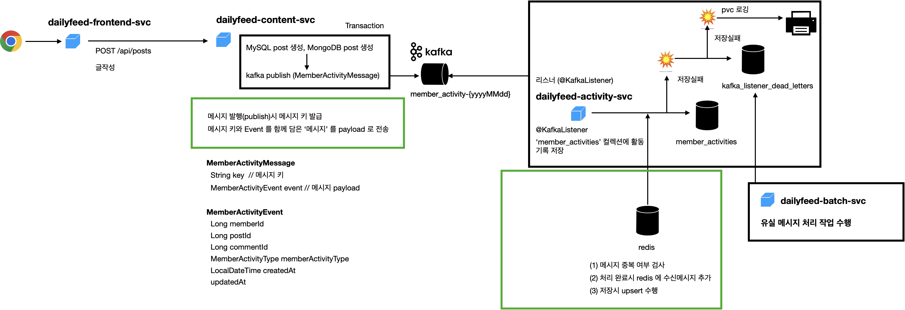

# 중복 메시지 체크 방식

 
 

**`At Least Once` 방식 채택으로 인한 중복 가능 메시지 처리 방식** 
`dailyfeed` 프로젝트에서는 Consumer Offset Commit 방식을 `At Least Once(최소 한번)`을 선택했습니다. 따라서 메시지가 중복되어 수신될 수 있는 가능성 역시 존재합니다. 메시지가 중복되어 수신될 수 있는 가능성이 있으므로, 애플리케이션 레벨에서 중복수신된 메시지인지 체크해야 합니다. `dailyfeed` 프로젝트에서는 중복 수신 여부를 체크할 수 있도록 하기 위해 메시지를 publish 시에 메시지 키를 고유키를 생성해서 해당 메시지에 대한 메시지키를 해당 고유 키로 식별하는 방식을 채택했습니다. 그리고 listen 시에는 publish 된 메시지의 메시지 키를 Redis 에 저장하거나 이미 Redis 에 존재하는 지로 중복 메시지 여부를 식별하며, 부차적으로 Database 에 저장시에도 메세지 키를 key 로 하는 upsert를 하게 함으로써 중복데이터 저장이슈를 해결했습니다. 
 

**메시지 키의 대략적인 구조** 
나노세컨드 단위까지 고유한 키를 인식할 수 있도록 했으며, 이 보다 더 정밀한 고유키를 원한다면, `pod id` 등을  활용할수 있지만, 이번 프로젝트에서는 이 정도 레벨까지는 진행하지 않고, 나노세컨드 단위까지 고유한 키를 인식하고, 이미 발송된 메시지에 대해 같은 메시지가 생성될 경우(나노세컨드까지 일치하는 요청이 발생하면) `429 (TOO MANY REQUEST)` 응답을 하도록 보완했습니다. 
 

**참고 : At Least Once 를 선택한 이유** 
참고로 `At Least Once` 를 선택한 이유는 `Exactly Once` 를 선택하는 것으로 인해 카프카 클러스터에 지나친 부하를 주지 않으면서, 애플리케이션 레벨에서도 메시지의 유실 가능성 대신 한번 이상 같은 메시지를 받으면서 최대한 메시지의 유실가능성을 줄이기 위해 `At Least Once`를 선택했는데요. 혹시라도 카프카에 대한 기본 개념에 대해서 잘 모르시거나 처음 접하시는 경우 https://alpha3002025.github.io/docs-kafka-summary/kafka-concepts/kafka-basic/  을 확인해주시기 바립니다. 
 

**참고 : 다른 사례에 응용한다면?** 
**증권 시세 처리** 
증권 데이터 처리시에는 원장 개발을 하는 시스템이 따로 있으며, 체결된 시세에 대한 API 역시 따로 존재하는데, 이때 거래에 대한 id 역시 전달됩니다. 따라서 `pod id`와 함께 데이터 제공처의 `trasaction id` 를 활용해 고유키 인식을 해주면 됩니다. 
 

**메신저** 
메신저의 경우 사용자의 너무 잦은 요청은 Rate Limiter 등을 통해 `Too Many Request(429)` Response 를 하거나, 메시지 publisher 측에서도 나노세컨드 이하로의 정밀한 요청은 악의적인 요청으로 간주해 `Too Many Request(429)` Response 등을 내려 보내서 다시 요청하도록 우회하는 것이 좋을 것이라고 생각합니다. 
 

## 메시지 키 형식
### `POST_CREATE`
글 작성시 생성되는 이벤트에 대한 메시지 키의 형식입니다.
- `member_activity:kafka_event:POST_CREATE###{postId}###{memberId}`
 

### `POST_UPDATE`,`POST_DELETE`,`POST_READ`
글 수정/삭제/조회 시의 메시지 키의 형식입니다.
- `member_activity:kafka_event:{POST_UPDATE|POST_DELETE|POST_READ}###{postId}###{memberId}###{yyyy-MM-dd HH:mm:ss.SSSSSSSSS}`
 

### `COMMENT_CREATE`
댓글/답글 작성시의 이벤트의 메시지 키의 형식입니다.
- `member_activity:kafka_event:COMMENT_CREATE###{postId}###{memberId}`
 

### `COMMENT_UPDATE`,`COMMENT_DELETE`,`COMMENT_READ`
댓글/답글 수정/삭제/조회 시의 메시지 키의 형식입니다.

- `member_activity:kafka_event:{COMMENT_UPDATE|COMMENT_DELETE|COMMENT_READ}###{commenttId}###{memberId}###{yyyy-MM-dd HH:mm:ss.SSSSSSSSS}`
 
  
### `LIKE_POST`,` LIKE_POST_CANCEL`
글 좋아요,글 좋아요 취소 시의 메시지 키의 형식입니다.

- `member_activity:kafka_event:{LIKE_POST|LIKE_POST_CANCEL}###{postId}###{memberId}`
 

  
### `LIKE_COMMENT`, `LIKE_COMMENT_CANCEL`
댓글 좋아요,댓글 좋아요 취소 시의 메시지 키의 형식입니다.

- `member_activity:kafka_event:{LIKE_COMMENT|LIKE_COMMENT_CANCEL}###{commentId}###{memberId}`

 

