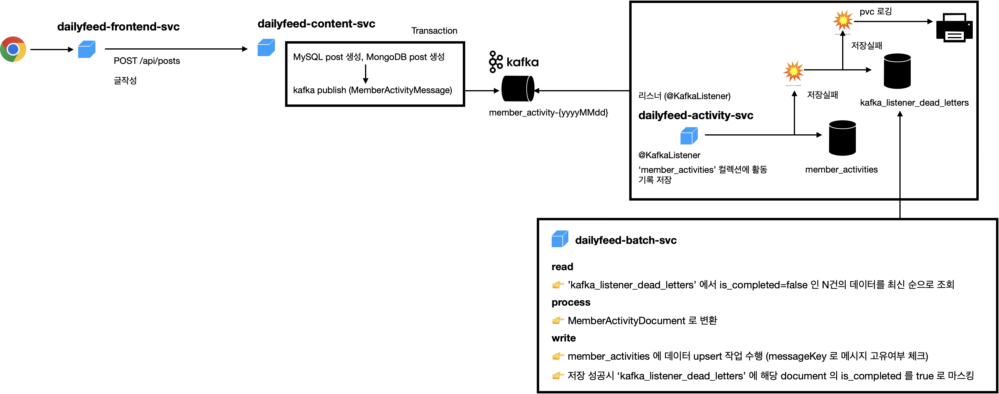
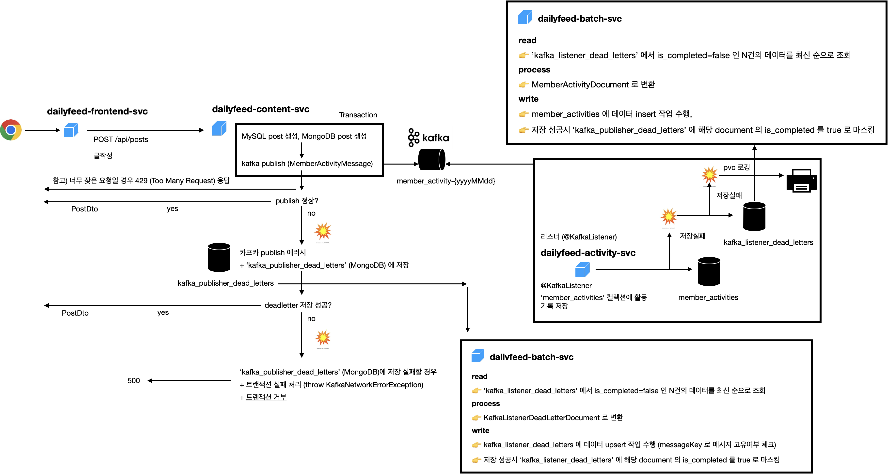

# 카프카 통신 실패 시 처리 대책

글 작성/수정/삭제 기능이 카프카로 메시지를 발송하는 것을 실패하는 것이 트랜잭션의 성공/실패를 좌우하게 된다면, 글 작성/수정/삭제 기능이 kafka 인프라의 상태나 유지보수에 영향을 받을 수도 있습니다. 인프라 팀에서도 kafka 의 증설,유지보수 작업 시에 서비스 쪽의 일정을 기다려야 하는 상황이 발생할 수 있습니다. 카프카 대신 Event 를 처리할 수 있는 방식이 두가지 이상 있다면 어떨까요? 이번 문서에서는 카프카 통신이 실패할 경우 dead letter 에 데이터를 저장하고 batch 를 통해 해당 작업을 완료시키는 예제를 다룹니다. 

실제 `dailyfeed` 코드 내에서는 다음 속성을 통해 `kafka` 로 서비스간 통신을 할지, `feign` 을 통해 서비스 간 통신을 할지 선택하는 것이 가능하도록 구성해두었습니다.
- `dailyfeed.services.content.publish-type.post-service` (참고 : dailfyeed-content-svc/PostService.java)
- `dailyfeed.services.content.publish-type.comment-service` (참고 : dailfyeed-content-svc/CommentService.java)

 

이렇게 외부통신 방식을 선택하는 코드에 대해서는 별도의 문서에서 따로 정리해둘 예정입니다. 이번 문서에서는 publisher, listener 측에서의 통신 실패 기록을 읽어들여서 정상처리하는 과정을 설명합니다. 
 
 

# publisher 측 에서의 통신 에러 처리
아래 그림은 글쓰기 기능인 `POST /api/posts` API 를 처리할때 어떻게 카프카 통신 실패 처리를 수행하는 지를 대략적인 그림입니다. 

 

(1) `dailyfeed-frontend-svc` ➝ `dailyfeed-content-svc`
- `POST /api/posts` 요청을 통해 글 작성 요청을 합니다.

(2) `dailyfeed-content-svc` ➝ `kafka`
- publish 가 성공할 경우 트랜잭션을 마무리하고 `dailyfeed-frontend-svc` 로 응답합니다.
- publish 가 실패할 경우 데드레터 저장소인 `kafka_publisher_dead_letters` 컬렉션에 데이터를 저장합니다.
- publish 가 실패하고 데드레터 저장소인 `kafka_publisher_dead_letters` 컬렉션에 데이터를 저장하는 것 역시 실패하면 트랜잭션을 실패시킵니다.
- publish 가 실패했지만 데드레터 저장소인 `kafka_publisher_dead_letters` 컬렉션에 데이터를 저장하는 것이 성공하면 트랜잭션을 마무리하고 `dailyfeed-frontend-svc` 로 응답합니다.

 

(3) `kafka` ➝ `dailyfeed-activity-svc`
- `dailfyeed-activity-svc` 내의 `@KafkaListener` 에서는 이벤트를 읽어들 인 후 `member_activities` 컬렉션에 활동 기록을 저장합니다.
- listener 측인 `dailyfeed-activity-svc` 에서의 dead letter 처리는 아래에서 따로 설명합니다.

 

(4) `dailyfeed-batch-svc`
- `kafka_publisher_dead_letters` 컬렉션에 저장된 데이터를 읽어들여서 `kafka_listener_dead_letters`의 데이터로 변환해서 저장합니다.
- `publishDeadletterRestoreJob` 라는 이름의 job 이며 kubernetes 의 cronjob 에 의해 1분에 한번씩 주기적으로 실행됩니다. 
- 발신에 실패한 데이터는 수신실패 저장소에 저장합니다. 
- 수신 실패 저장소의 데이터는 listener 측 수신실패 처리 배치 잡에서 messageKey 를 통해 이미 저장된 데이터를 분별해서 멤버 활동 기록을 upsert 하는데, 이 작업은 kubernetes 의 cronjob 에 의해 주기적으로 실행됩니다. 하단의 `listner 측에서의 통신 에러 처리` 섹션에서 자세히 다룹니다.

 

# listener 측 에서의 통신 에러 처리

 

메시지를 수신했지만, 저장에 실패하면 메시지를 버리는 것(유실)은 장애입니다. kafka 라는 통신을 선택했을 때 통신 실패에 대한 후처리 정도는 있어야 kafka 를 실무에서 적용할 수 있다고 생각합니다. 
 

(1) `dailfyeed-activity-svc`  ➝ `Database (MongoDB)`
- `@KafkaListener` 를 통해서 정상적으로 메세지를 수신한 후 역직렬화 등의 부수 작업이 성공한 후 데이터를 `member_activities` 저장소에 저장하는 작업에 성공하는 경우는 정상적인 케이스입니다.
- 이때 수신 성공 후 데이터를 저장할 때에는 메시지의 키인 `messageKey` 를 key로 하는 `upsert` 작업을 수행하는데, `messageKey` 에 대해서는 추후 다른 `3. 중복 메시지 체크 방식`에서 설명합니다.
- kafka 설정 시 `Exactly Once` 대신 `At Least Once` 를 채택했기 때문에 중복 메시지를 수신하는 경우가 존재할 수 있습니다. 여기에 대해서는 `2. kafka 설정` 에서 설명합니다.
- `@KafkaListener` 를 통해서 데이터를 `member_activites` 에 저장하는 것에 실패할 경우 리스너 수신실패 저장소인 `kafka_listener_dead_letters` 에 저장합니다.
- 만약 수신실패 저장소인 `kafka_listner_dead_letters` 에 저장하는 것 역시 실패한다면 pvc 에 로깅합니다. (이번 문서에서는 이 내용은 배제합니다. 구현 막바지에 해당 기능은 제거했습니다.)

(2) `dailyfeed-batch-svc` 
- `kafka_listener_dead_letters` 컬렉션에 저장된 데이터를 읽어들여서 payload 에 맞도록 데이터를 읽어들여서 `member_activities` 에 저장합니다.
- 수신시 실패한 데이터를 읽어들여서 `member_activities` 컬렉션에 저장합니다.
- `listenerDeadletterRestoreJob` 라는 이름의 job 이며 kubernetes 의 cronjob 에 의해 1분에 한번씩 주기적으로 실행됩니다. 
	- 참고 : cronjob 들의 스케쥴은 다음 파일들에서 찾아보실 수 있습니다.
		- dailfyeed-installer/dailyfeed-app-helm/batch/values-dev-batch.yaml
		- dailfyeed-installer/dailyfeed-app-helm/batch/values-local-batch.yaml

 
 

# 전체 흐름
publisher, listener 측에서의 통신 에러 처리를 하나의 그림에 모아서 보면 다음과 같습니다.

