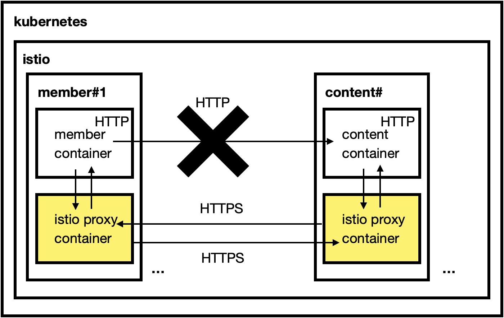
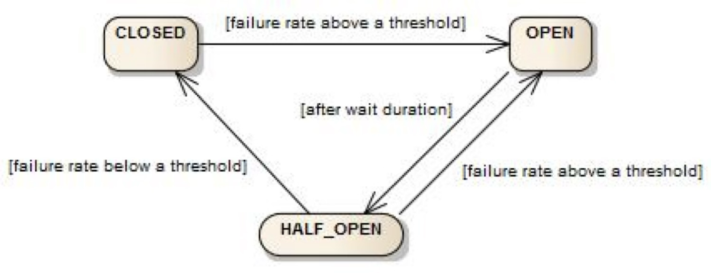

# 프로젝트 리뷰 - 지원되는 기능들
> obsidian (https://obsidian.md) 를 통해 현재 리포지터리 디렉터리를 열어서 확인하시면 조금 더 가독성 높게 내용을 파악하실수 있습니다.<br/>

<br/>


# 서비스 간 통신시 https 지원
>`dailyfeed` 프로젝트에서는 서비스 간 통신시 https 를 기본으로 지원합니다.<br/>

istio 에 의해 서비스 메시가 관리되는 환경에서는 다음과 같이 `istio proxy` 라고 부르는 container 가 각각의 Pod 에 주입됩니다. 


<br/>

이 `istio proxy` 는 istio 설정을 통해 활성화되고 나면 파드 내에서 파드 외부와의 통신을 수행하는 '대리인 (proxy)' 역할을 수행하게 됩니다. `istio proxy` 에는 외부와 통신을 할때 `mtls (Mutual TLS)` 라고 하는 `상호 tls` 설정을 할 수 있습니다. `dailyfeed` 프로젝트에서는 peer authentication `mtls` 의 mode 를 `strict` 로 강제했습니다. 이렇게 할 경우 평문 http 요청에 대해 다음과 같이 동작합니다.<br/>

peer authentication 활성화된 네임스페이스 내에서 파드 A 에서 파드 B 로의 API 요청시 http 로 요청시
- `istio proxy` container 가 자체적인 mtls CA 인증서를 통해 https 통신을 수행합니다. 
- `istio proxy` 의 관리 내에 있는 영역 내에서의 통신은 모두 `istio` 의 자체적인 mtls CA 인증서를 활용해서 https 통신을 수행합니다.
- 즉 애플리케이션 레벨에서는 https 통신을 직접 구현하지 않아도 istio proxy 가 직접 기본적으로 다른 istio proxy 와의 통신은 https 로 통신합니다.
<br/>

외부 API 로의 http 요청시
- `istio proxy` 컨테이너가 `http` 요청을 감지해 거부하게 됩니다. 
- peer authentication 의 `mtls mode` 를 `strict` 로 설정했기 때문입니다.
<br/>


istio 의 PeerAuthentication 은 기본적으로 `permissive` 이지만, 권장되는 설정은 `strict` 입니다. `dailyfeed` 프로젝트의 백엔드 및 프론트엔드 애플리케이션이 배포되는 kubernetes 내의 `dailyfeed` 네임스페이스에는 `strict` 로 mtls 모드를 설정해서 서비스간 의 통신을 `https` 로 하도록 설정했습니다.<br/>

```yaml
apiVersion: security.istio.io/v1
kind: PeerAuthentication
metadata:
  name: default
  namespace: dailyfeed
spec:
  mtls:
    mode: STRICT
```
<br/>

이렇게 하면, `dailyfeed` 네임스페이스 안에서 `istio proxy` 가 관리하는 파드 내의 서비스 간에 http 로 호출을 하더라도 통신은 `istio proxy` 가 대리(proxy)해서 수행하면서 `istio proxy container` 간에 https 로 통신을 수행하게 됩니다.<br/>
<br/>

> 참고: `mtls.mode = permissive`<br/>
> `mtls.mode` 를 `permissive` 로 설정하면 `istio proxy` container 를 가지고 있는 pod 간에는 https 로 통신이 이뤄지지만, 그 외의 통신(e.g. 외부 API 요청/응답)에는 https 요청이 아닌 http 기반의 평문 요청도 허용하게 됩니다.<br/>

<br/>


# Key Refresh + AccessToken/RefreshToken + Blacklist
>`dailyfeed` 프로젝트에서는 인증에 대해 `Key Refresh, AccessToken/RefreshToken, Blacklist` 개념을 사용했습니다.<br/>

- Key Refresh
- Access Token, Refresh Token
- Blacklist
<br/>

**Key Refresh, AccessToken/RefreshToken**<br/>
서버의 비공개 키를 1시간에 한번씩 새로고침합니다. 보안상 서버의 비공개키는 계속해서 변경되는 것이 좋습니다. 더 잦은 주기를 설정할까 했는데, 이번 프로젝트에서는 1h 정도가 적절하다고 판단해서 서버 비공개키를 1시간에 한번씩 새로고침합니다.<br/> 

만약 사용자가 로그인 이후 로그인을 유지하고 있는 상태에서 1시간 뒤에 프론트엔드를 통해 특정 작업(e.g. 글쓰기, 글 수정 등)을 수행하려 하면 해당 시점에는 비공개 키가 만료된 키 이므로 `{‘X-Token-Refresh-Needed’: ‘true’}` 를 응답받습니다. 이후 frontend 는 하려던 작업(e.g. 글 쓰기, 글 수정)을 잠시 중단하고 서버에 `POST /api/key/refresh` 요청을 통해 새로고침된 서버의 비공개 키에 대해 새로운 accessToken, refreshToken 의 쌍을 발급받습니다. 그리고 하려고 했던 작업(e.g. 글 쓰기, 글 수정)을 이어서 수행합니다.<br/>

`accessToken` 의 만료기한이 도래한 시점에서 frontend 가 서버로 요청을 수행할 때 역시 frontend 는 `{‘X-Token-Refresh-Needed’: ‘true’}` 를 응답받으며, `POST /api/key/refresh` 를 통해 새로운 accessToken, refreshToken 을 발급받은 후 하던 작업을 다시 시도합니다.<br/>
<br/>

**참고**<br/>
`POST /api/key/refresh` 시에는 로그인 요청시 서버가 쿠키에 심어둔 `refreshToken` 이 사용되는데, 이 `refreshToken` 은 `httpOnly` 로 해두었고, `sameSite = strict` 로 설정해두었기 때문에, javascript 등으로 브라우저에서의 악의적인 조작이 불가능합니다.<br/>
<br/>

**Blacklist**<br/>
로그아웃 한 사용자는 Blacklist 라는 곳에 해당 JWT 의 id 인 `jti` 를 저장합니다. 만약 로그아웃 한 후에 같은 `jti` 로 서버에 요청을 할 경우 `401 UnAuthorized {X-Relogin-Required: true}` 를 응답받게 되고 frontend 는 모든 토큰을 무효화 처리 후 로그인 페이지로 사용자를 redirect 시킵니다.<br/>
<br/>

**참고) `refreshToken` CSRF 방지**<br/>
현재 `refreshToken`은 사용자가 로그인할때, `/api/key/refresh` 를 통해 새로운 `accessToken/refreshToken` 의 쌍을 재발급 받을때 부여되는데, 이때 서버 측에서는 `sameSite = strict`, `httpOnly` 로 설정합니다. 이렇게 `sameSite = strict` 로 설정하면, 동일 도메인에서만 접근할수 있도록 하는 것이기에, 브라우저 등에서 Javascript 를 통한 악의적 접근 또는 오용이 방지됩니다. 또한 `httpOnly` 로 쿠키를 발급했기 때문에 브라우저에서 `console.log` 등을 통해 `document.cookie` 를 모두 출력해보더라도 서버에서 발급한 `httpOnly` 쿠키인 `refreshToken` 은 확인할 수 없습니다.<br/>
<br/>

# HPA
> `dailyfeed` 프로젝트에서는 쿠버네티스 파드 들의 스케쥴링에 `HPA` 를 적용해 급작스러운 트래픽 증가에 대응할 수 있도록 했습니다.<br/>


트래픽의 급작스러운 스파이크가 발생할 때 사람이 5분 내로 즉각 대응하는 것은 불가능에 가깝습니다. `HPA (Horizontal Pod Autoscaling)` 는 CPU,Memory 등과 같은 리소스의 특정 지표의 임계값에 대해 수평적으로 scaleUp 할지 scaleDown 할지를 정의해서, 특정 임계값을 넘어갈 때 자동으로 대응할 수 있도록 해줍니다.  `HPA` 를 사용하면, 급작스러운 트래픽의 스파이크로 인해 리소스가 부족할 때 몇분 안에 스케일 아웃 대응이 자동으로 이뤄질 수 있다는 것이 장점입니다. `HPA` 는 쿠버네티스의 플러그인 중 `metrics-server` 를 설치하고나면, 사용할 수 있습니다.<br/>

다만, kuberntes 의 `resources.requests`, `resources.limit` 에 대해 알고 계신다면, `resources.requests` 가 노드의 사양을 넘어서면, 이 때부터는 Pod 가 스케쥴링 되지 않고 Pending 상태로 진입하는 것에 대해 알고 계실 것입니다. 이런 이유로 Deployment 로 애플리케이션을 배포할 때 현재 사용하려는 쿠버네티스 클러스터 내의 각 노드들의 사양 들도 잘 파악하고 있어야 하고, 몇개 정도의 레플리케이션으로 구성할지를 계산해서 적용해야 합니다. HPA 를 통해 리소스의 스케일아웃을 자동화한다고 하더라도 급작스러운 트래픽 스파이크에는 대응하는 것이 가능하지만, 클러스터 워커 노드가 수용할수 있는 사양이 `resources.requests` 의 합을 넘어서면 그 다음 Pod 부터는 `Pending` 상태에 빠질 수 있다는 점을 알고 있어야 합니다. 물론 `EKS` 등을 사용하면 트래픽이 급증해서 클러스터의 워커 노드의 수를 스케일 아웃하는 설정을 할수도 있고, 기본 지원되는 기능에 더해 `Karpenter` 등을 통해 노드 프로비저닝을 자동화 하는 것 역시 가능합니다.<br/>
<br/>

쿠버네티스를 처음 배울 때 또는 접한지 얼마 안되었을 때는 `HPA` 를 '만능'으로 착각하는 경우도 가끔 있습니다. 하지만, 어느 정도는 현재 개발 중인 애플리케이션의 리소스의 최소/최대 사양 정도는 파악해서 `resources.requests`, `resources.limit` 을 정의해야 하며, HPA 적용 시에도 이 내용에 기반해 `scaleUp`, `scaleDown` 에 대해 합당한 설정을 해줘야 합니다.<br/>

# Istio
Istio 에서는 '서비스 메시 (Service Mesh)'라고 부르는 개념이 있습니다.


`Mesh` 는 영어 단어 그 자체로는 `그물망`, `철망` 이라는 의미를 가집니다. 서비스 메시(Service Mesh) 라는 것은 Service 를 감싸고 있는 '그물'을 위미합니다. 즉, `Service Mesh` 라는 용어의 의미는 `Kubernetes` 내의 서비스들의 네트워크 들을 감싸는 그물같은 `Network 레벨의 그물(Mesh)`을 의미합니다.<br/>

Istio 를 사용하면, 1차적으로 ‘Mesh’라고 부르는 Network 레벨에서 통합적인 제어 (라우팅, HTTPS, Timeout, HTTP Retry, CircuitBreaker, Connection Pool 등) 를 수행할 수 있습니다. 물론 Circuit Breaker, HTTP Retry 등은 소프트웨어 레벨에서도 미리 지원하도록 할수 있습니다. 다만, 인프라 레벨에서도 미리 정해진 기본 정의를 제공한다면, 이런 설정이 불필요한 애플리케이션(e.g. 단기 프로모션 페이지)에 대해서도 Circuit Breaker, HTTP Retry 등과 같은 기능들을 기본적으로 지원할 수 있게 됩니다. 이런 기능들은 대부분 Istio 의 Virtual Service, Destination Rule 등의 기능에서 제공하는데 다양한 기능들을 제공하고 있어서 예를 들면 '너무 잦은 요청에 대해 네트워크 레벨에서 거부하고, 다음 타음 윈도우에 재요청하도록 지정'하는 것도 가능합니다. 애플리케이션에서 지원하지 않을 수도 있는 HTTPS, Timeout, HTTP Retry, CircuitBreaker, Connection Pool 등을 예방적인 차원에서 인프라레벨에서도 제공한다는 것은 서비스 운영시에 조금 더 안전하게 운영할 수 있도록 도와줄수 있는 요소라고 생각합니다.<br/>

**Istio 로 할수 있는 것**<br/>
Istio를 사용하다보면 다양한 기능들을 지원한다는 사실에 놀라게 됩니다. 예를 들면 Istio 를 사용하면 특정 운영 장애 또는 배포 상황에서 특정 서버 애플리케이션으로의 라우팅되지 않도록 애플리케이션 레벨의 Gateway를 수정해서 재배포하는 대신, VirtualService, DestinationRule 등을 제정의하거나 추가해서 라우팅을 수정하는 것 역시 가능합니다. 장애가 발생한다거나 할 경우 특정 버전의 이미지 대신 다른 버전으로 라우팅 되도록 하는 것이 가능하며, 특정 버전으로의 라우팅 비중을 서서히 늘려가며 반응을 살피는 배포방식인 배포방식인 카나리 배포를 VirtualService, Destination Rule 를 이용해서 제공하는 것 역시 가능해집니다.<br/>

**Kiali 대시보드 지원**<br/>
현재 프로젝트 내에서는 kubernetes 클러스터 내에 Istio 설치 시에 Kiali 역시 설치되도록 설치 스크립트를 작성해두었습니다. Kiali 는 istio 에 관련된 리소스와 `istio-injection` 이 설정된 리소스들의 네트워크 흐름을 한눈에 보고 제어할 수 있는 대시보드입니다. 이 kiali 대시보드에서는 특정 서비스에서 다른 서비스로의 요청을 막는다거나, 특정 label 이 붙은 서비스의 경우 다른 서비스로 라우팅한다거나 하는 기능을 GUI 에서 수정하는 것 역시 가능합니다. 물론, 이런 내용들은 가급적 yaml 을 통해 작성해야 `infra` 레벨의 수정 내역이 기록되고 이력관리가 될 수 있기에 GUI 에서의 즉시 접근은 `지양`해야 하겠지만, 급작 스러운 장애 시에 네트워크의 흐름을 대시보드의 GUI 등을 통해 차단하거나 다른 곳으로 흐르게 할수도 있고, 전체 네트워크 상황을 모니터링 할 수 있기에 `Kiali` 대시보드를 구축해두는 것 역시 운영에 도움이 될 것이라고 생각합니다.<br/>
<br/>


# Resilience `feign`, `circuit breaker`, `rate limiter`, `retryer` 지원
소프트웨어 레벨인 서버 애플리케이션 레벨에서도 `circuit breaker`, `rate limiter` 를 지원하고 있습니다.<br/>

## `feign`, `circuit breaker`



<br/>

`circuit breaker` 는 현재 서비스에서 다른 마이크로서비스로 feign 을 통해 API 요청 시 특정 기준에 미달될 경우 장애가 났다고 판정을 하고 해당 서비스로의 호출을 차단하거나 자동복구되는 차단을 하거나 장애 회복시 복구를 하는 등의 설정을 제공하는 기능입니다.<br/>
<br/>

`circuit breaker` 에서는 다음과 같은 3가지의 주요 상태가 있습니다.
- `CLOSED` (닫힘 - 정상)
- `OPEN` (열림 - 차단)
- `HALF_OPEN` (반열림 - 테스트)
<br/>

`HALF_OPEN` 시 에는 서비스 회복 여부를 체크하는 네트워크 테스트가 내부적으로 수행되며, 테스트 결과에 따라 CLOSED(정상복구), OPEN(차단)으로 변화합니다.<br/>
<br/>

장애가 발생해서 `OPEN` 된 상태에서는 주기적으로 해당 엔드포인트의 상태를 체크해서 특정 임계값에 도달할 경우 다시 `CLOSED` 로 돌아가면서 서비스의 정상화를 수작업 없이 수행할 수 있으며, 급작스러운 장애 대응이 가능하기에 `HALF_OPEN` 은 중요한 개념입니다.<br/>
<br/>


## `rate limiter`
`rate limiter`는 현재 서비스에서 다른 마이크로서비스로 `feign` 을 통해 요청을 호출하는 outbound 요청의 빈도(rate)를 제한하는 기능입니다.<br/>

`rate limiter` 를 사용하면 다음과 같은 장점이 있습니다.

 - `self-protection` : 다른 서비스에 과부하를 주지 않도록 보호해줄수 있습니다.
 - `연쇄 장애 방지` : 현재 서비스에서의 과도한 요청으로 인해 전체 시스템에 영향을 주지 않도록 합니다.
 - `호출 주기 안정화` : 특정 서비스로의 급격한 트래픽 증가시 제한을 걸수 있습니다.
 
 일정한 양의 최소/최대 호출 가능 rate 를 지정하면, 현재 시스템 내에서 해당되는 대상 서비스 역시 어느 정도의 트래픽을 허용치로 둘지 명확해집니다.<br/>
<br/>

설정의 정도에 따라 `default`, `critical`, `conservative` 로 분류했으며, 서비스 별로 다음과 같이 지정해두었습니다.
- critical : timeline-svc, member-svc
- default : content-svc, activity-svc
- conservative : image-svc

<br/>

## `retryer`
`retryer` 는 현재 서비스에서 다른 마이크로서비스로 `feign` 을 통해 요청을 호출시 에러 발생시 재시도 횟수, 재시도 전 timeout 정도, 어떤 Exception 에 대해 재시도할지 등에 대한 재시도 설정입니다.<br/>

retryer 를 사용하면 다음의 장점들이 있습니다.
 - 불필요한 재시도 방지 (e.g. 4xx 등에 대해서는 즉시 실패 처리)
 - 의미있는 재시도 (e.g. 네트워크 장애, 타임아웃의 경우 재시도하도록 설정)
 - `Backoff` 전략으로 부하 분산 (백오프 : 시스템이 실패 후 재시도할 때 즉시 재시도하지 않고 일정시간 대기하는 전략을 의미합니다.)

<br/>

설정의 정도에 따라 `default`, `fast`, `conservative` 로 분류해두었고, 각 서비스별로 다음과 같이 지정했습니다.
- `fast` : timeline-svc, member-svc
- `default` : content-svc, activity-svc
- `conservative` : image-svc

<br/>

예를 들어 `default` 설정의 경우 다음과 같습니다.<br/>
<br/>

`max-attempts: 3` 
 - 최대 3번까지 시도 (최초 1번 + 재시도 2번), 실패 시 총 3번의 호출 시도 후 최종 실패 처리

`wait-duration: 500ms` 
 - 각 재시도 사이의 대기 시간 (실패 후 재시도 하지않고 500ms 를 기다린 후 재시도)
 - 장점
   - `backoff` : 대상 서비스에 즉시 재시도하지 않고 일정시간 대기하는 것을 `backoff` 라고 합니다.
   - 일시적 장애 회복 시간 제공 : retry 하기 전에 term 을 두어서 회복시간 부여

`retry-exception`: 
 - 어떤 exception 발생시 재시도 할지

`ignore-exceptions`
 - 어떤 exception 발생시 재시도를 하지 않을지

<br/>

**참고) `backoff` 의 종류**<br/>
`Fixed Backoff` (고정 백오프)
- 매번 동일한 시간 대기
- `e.g. 500ms → 500ms → 500ms`

<br/>

`Exponential Backoff` (지수 백오프)
- 재시도마다 대기 시간이 지수적으로 증가 
- `e.g. 100ms → 200ms → 400ms → 800ms`

<br/>

`Linear Backoff` (선형 백오프)
- 재시도마다 대기 시간이 선형적으로 증가
- `e.g. 100ms → 200ms → 300ms → 400ms`

<br/>


# Create/Update/Delete 트래픽과 Read 트래픽의 스케일아웃 그룹 분리

Create/Update/Delete 트랜잭션을 수행하는 트래픽 그룹과 Read 트래픽을 수행하는 트래픽 그룹이 서로 다른 그룹으로 스케일 아웃 될수 있도록 서비스를 구성했습니다.

 **Create/Update/Delete 트랜잭션을 수행하는 트래픽 그룹**<br/>

<br/>
<br/>

**Read 트랜잭션을 수행하는 트래픽 그룹**<br/>

<br/>
<br/>

이렇게 하면, 슬로우 쿼리 등이 발생하는 Read 트랜잭션 그룹의 부하가 Create/Update/Delete 트랜잭션 그룹에 영향을 주지 않고, 쓰기 트랜잭션에서 발생하는 부하(좋아요 급증, 댓글 작성 폭주 등)가 Read 트랜잭션 그룹과는 별개로 발생하기에 각각의 성격에 따라 다르게 용도에 따라 대응할 수 있다는 유연성을 가지게 됩니다.<br/>
<br/>
