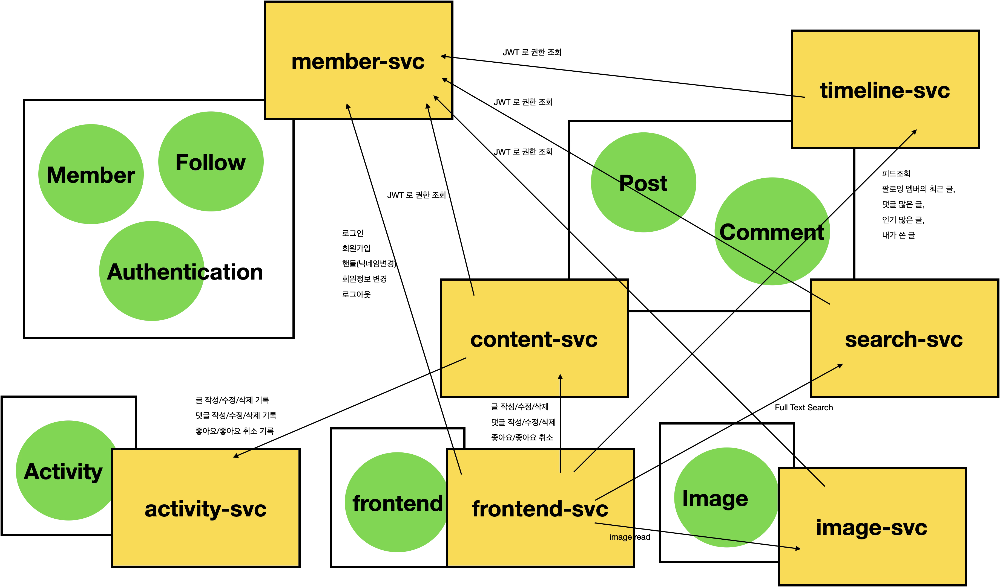

# 도메인 경계 정의 (스케일아웃 성격별 분류)

 
 

## 역할
주요 서비스들이 수행하는 일은 다음과 같습니다. 
 

member-svc
- 회원정보 관리 : 회원가입/로그인/로그아웃, handle 변경, 프로필 이미지 변경, 회원정보(주소,소개 등)변경
- 인증정보 관리 : JWT 새로고침, 서버 비공개 키 새로고침, 타 서비스로부터의 인증/권한 조회 요청 처리
- 소셜기능 관리: 팔로우/언팔로우, 팔로워/팔로잉 목록 조회
 

content-svc
- 글 관리: 글 작성/수정/삭제
- 댓글/답글 관리: 댓글/답글 작성/수정/삭제
- 좋아요 관리 : 좋아요/좋아요취소
 

timeline-svc
- 피드 조회 (팔로우 하고 있는 멤버들의 최근 글)
- 댓글 많은 글 리스트/상세 조회
- 인기 많은 글 리스트/상세 조회
- 내가 쓴 글 리스트/상세 조회
 

activity-svc
- 글 활동 기록 : 글 작성/수정/삭제 활동 기록
- 댓글/답글 활동 기록 : 댓글/답글 작성/수정/삭제 활동 기록
- 좋아요/좋아요 취소 활동 기록 : 좋아요/좋아요 취소 활동 기록
- e.g. 알림 배너 용도 (현재 버전(season1) 에서는 알림배너 미지원)
 

search-svc
- 본문/댓글/답글 Full Text Search 수행
 

image-svc
- 프로필 이미지 조회/업로드/수정
 

frontend-svc
- 사용자 요청 처리 
- Next.js, Typescript (Server Rendering 기반)
 

## 도메인 구성 시 고려한 사항들

도메인을 위와 같이 구성한 이유는 다음의 목적에 따라 구별하게 되었고, 가장 중점적으로 고려한 사항은 "'스케일아웃'이 용이하도록 하는 그룹을 정의하기" 였습니다. 
- 트랜잭션의 읽기/쓰기(Read/Write) 용도별 스케일아웃
- 인증 도메인을 독립적인 그룹으로 스케일아웃
- File I/O 그룹 스케일아웃

 

## 트랜잭션의 읽기/쓰기 용도별 스케일아웃

Post, Comment 도메인은 `frontend-svc` 로부터 접근시 글/댓글에 대한 접근이 이뤄집니다. 도메인을 분류 시에는 스케일아웃이 Read 그룹의 스케일아웃, Write 그룹의 스케일아웃 으로 트랜잭션의 종류별로 스케일아웃이 용이하도록 하는 것에 초점을 두었습니다. Read 트랜잭션의 경우 슬로우쿼리가 있을 수도 있고, 특정 케이스에는 광고 알고리즘을 적용해야 할 경우도 있습니다. 또한 애플리케이션이 버전이 올라가고 개편을 반복할때마다 검색 조건에 따라 API 의 스펙이 달라질 수도 있습니다. Write 트랜잭션의 경우 글을 쓰는 작업 도중에 글을 임시저장하거나, 댓글 작성/수정/삭제, 좋아요,좋아요 취소 등의 고빈도 쓰기 연산이 발생할수 있습니다. 

**post-svc 로 분류할 경우** 
만약 post-svc 라는 서비스 안에 글쓰기,좋아요/좋아요 취소, 팔로잉 멤버의 최근 글 목록 등의 기능이 있다고 해보겠습니다. 글쓰기 또는 좋아요/좋아요 취소 시에 '팔로잉 멤버의 최근 글 목록' 기능이 슬로우 쿼리로 실행되어 글쓰기 작업이 발생한다면 어떨까요? 이 경우 post-svc 가 통째로 스케일 아웃이 될 것입니다. 이와 같은 현상이 반복되면, post-svc 전체가 스케일아웃이 됩니다. 장애는 발생하지 않겠지만, 슬로우쿼리가 발생하는데 글쓰기,좋아요/좋아요 취소 등의 기능을 수행하는 파드까지도 함께 스케일 아웃됩니다. 

배포 버전 별로도 고민해보겠습니다. 만약 광고 추천 알고리즘이 변했을 경우를 고려해보겠습니다. 이 경우 배포시에 글쓰기 기능에 연관된 기능 역시도 이미지의 버전이 올라가게 됩니다. 반대로 글쓰기 시에 임시저장한 글의 버전관리 기능을 수정한 경우를 예로 들어보겠습니다. 이 경우 배포 시에 광고 추천 알고리즘에 관련된 기능 역시도 이미지의 버전이 올라가게 됩니다. 따라서 post-svc 내에 읽기와 쓰기 그룹을 같이 관리할 경우 이미지의 형상관리나 배포 프로세스 측면에서 봐서도 관리의 효율성이 떨어지게 됩니다. 
 

**읽기 그룹 (timeline-svc(RO), search-svc(RO)), 쓰기 그룹 (content-svc(WO)) 으로 분류할 경우** 
timeline-svc 로 분류한 스케일 아웃 그룹에서는 복잡한 조회 쿼리를 담당하고, content-svc 스케일아웃 그룹에서는 글/댓글/답글 작성/수정/삭제, 좋아요/좋아요 취소를 담당하는 경우를 생각해보겠습니다. 이 경우 슬로우쿼리가 발생하면, grafana 등과 같은 대시보드에서 READ 트랜잭션에서 부하가 발생한다는 것을 확인하고 직접 스케일 아웃을 조정하거나, 미리 정의된 HPA 를 통해 트래픽의 스파이크에 대응할 수 있습니다. 이때 슬로우 쿼리 이슈를 대응할 때 글/댓글 작성/수정/삭제 기능에는 영향을 주지 않는 다는 장점이 있습니다. 

배포 버전 별로도 고민해보겠습니다. 슬로우쿼리 기능을 수정해서 timeline-svc 에 반영했고 수정된 버전에 대해 이미지 버전을 올려서 배포했습니다. 글/댓글/답글 작성/수정/삭제 기능의 경우 content-svc 에서 별도로 운영되고 있기 때문에 별도로 이미지 버전을 배포할 필요가 없습니다. 이렇게 해서 용도별로도 이미지의 버전을 관리할 수 있어서 운영과 관리 역시 조금 더 효율적으로 변했습니다. 

 

 
 

**물론 단점도 있습니다.** 
초기 개발 시점에는 혼선을 일으킬수 있다는 점이 단점입니다. 어떤 프로젝트든 초기 개발시에는 아직 기능이 계속 변해야 하는 시점입니다. 이 시점에 timeline-svc, content-svc 로 분류해둘 경우 프로젝트를 통제하기 쉽지 않을 수 있습니다. 저 역시 작업을 하면서 처음에는 content-svc 라는 프로젝트에서 모두 개발한 후 content-svc 내에서 READ 에 관련된 기능들만 따로 떼어서 timeline-svc 로 분리했습니다. 즉, 초기 개발 시에는 혼선을 빚을수 있다는 것은 단점입니다. 

참고) content-svc, timeline-svc 사이에 서로 데이터 로직을 공유하지 않기에 '데이터로직이 공통화되지 않는다'는 점이 단점으로 느낄 수 있습니다. 이 부분은 '개발편의성'에 대한 부분인데, 사실 '개발편의성' 보다는 각 기능별 '독립성'이 더 중요할 수 있기에 이 부분은 단점이 되지 않을 것 같습니다. '개발하기 편해서'라는 이유는 설계 시에 좋은 이유는 아닌 것 같습니다. 데이터 로직이 한 곳에 단일화 될 경우, 버전관리나 형상관리도 쉽지 않아질 수 있기에, 이 부분은 단점으로 분류하지 않는 것이 나아보입니다. 
 

## 인증 도메인을 독립적인 그룹으로 스케일아웃

로그인/로그아웃/회원가입 및 인증, 팔로우/언팔로우 연산에 대해 `member-svc` 에서 처리하도록 하고 스케일아웃의 단위 역시 `member-svc` 로 분류했습니다. `member-svc` 구성 시에 `follow`나 `member` 조회에 관련된 워크로드를 따로 세분화해서 분류할지도 고민했었는데, 결론적으로는 `member-svc` 에서 인증,멤버 관련 연산을 모두 통합적으로 제공하기로 했습니다. 

추후 제공하는 기능이 다양해져서 생체인증이나 Open ID, OAuth2 등 다양한 인증방식을 도입하게 될경우 member-svc 에서 인증 로직을 따로 분류해서 `authentication-svc` 로 세분화하게 될 것 같습니다. authentication 의 이미지 버전의 변화가 member, follow 등의 도메인에 영향을 자주 끼치게 될 경우 분리를 결정하게 될 것 같습니다. 
 

## File I/O 그룹 스케일 아웃
이미지를 읽어들이거나 업로드하는 작업은 현재 PVC 기반으로 구현해두었는데, S3 기반으로 전환하더라도 이미지를 업로드하거나 조회하는 작업의 경우 별도의 스케일 아웃 그룹으로 정의해두는 것이 운영 시에 더 효율적으로 관리할수도 있고 신속하게 대응하는 것 역시 가능합니다. 이런 이유로 File I/O 성격을 띄는 image-svc 는 별도의 스케일아웃 그룹으로 구성했습니다. 프로젝트 개발 시에는 조금 더 개발작업은 불편해질 수 있지만, 운영시에 모니터링 툴을 통해 File I/O 관련 병목사항을 케치해서 스케일 아웃을 조정한다거나 HPA 를 통해 급작스러운 트래픽 스파이크에 대응시 리소스 효율적으로 대응할수 있게 된다는 장점이 있습니다.

