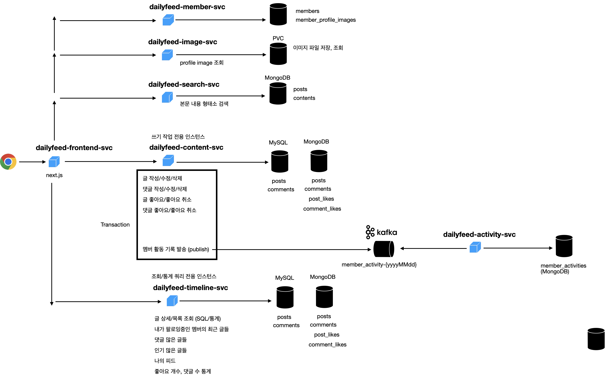

# 전체 구성도
전체 구성도는 다음과 같습니다.

 
 

## `dailyfeed-frontend-svc`
- 사용자(브라우저)는 `dailyfeed-frontend-svc` 와 통신을 합니다. dailyfeed-frontend-svc 는 next.js 기반의 프론트엔드 서버 애플리케이션입니다. 
- next3 기반으로 구성되어 있으며 frontend 를 서버 애플리케이션으로 제공할수 있습니다.
- next3 기반의 애플리케이션은 도커이미지를 통해 스케일 아웃이 가능하며, kubernetes 내에 `dailyfeed-frontend` 라는 이름의 deployment 로 배포합니다.
- istio proxy 컨테이너에 의해 통신이 이뤄집니다.
 

## `dailyfeed-member-svc`
- 인증 및 멤버 관련 연산을 담당합니다.
- kubernetes 내에 `dailyfeed-member` 라는 이름의 deployment 로 배포합니다.
- istio proxy 컨테이너에 의해 통신이 이뤄집니다.
 

## `dailyfeed-content-svc`
- Write 트랜잭션 수행을 담당합니다.
- Post, Comment 도메인에 대해 Write 트랜잭션에 해당되는 스케일 아웃 그룹입니다.
- kubernetes 내에 `dailyfeed-content` 라는 이름의 deployment 로 배포합니다.
- 글/댓글/답글 작성/수정/삭제 시 멤버활동 기록을 `kafka` 에 publish 합니다.
- dead letter 처리 등을 별도로 수행하는데 여기에 대해서는 `/tmi-docs/kafka` 디렉터리에서 정리합니다.
- 글/댓글/답글 작성/수정/삭제 시 MongoDB 의 `posts`, `comments` 에도 도큐먼트가 추가되는데 이때 MySQL 의 `posts`,`comments` 의 pk 필드도 함께 저장합니다. 같은 트랜잭션 내에서 저장/수정/삭제 연산이 이뤄지기에 MongoDB 와 MySQL 사이에 데이터가 맞지 않는 현상은 발생하지 않습니다.
- istio proxy 컨테이너에 의해 통신이 이뤄집니다.
 

## `dailyfeed-timeline-svc`
- Read 트랜잭션 수행을 담당합니다.
- Post, Comment 도메인에 대해 Read 트랜잭션에 해당되는 스케일 아웃 그룹입니다.
- kubernetes 내에 `dailyfeed-timeline` 라는 이름의 deployment 로 배포합니다.
- 복잡한 통계성 쿼리, 조회 쿼리 를 수행하는 역할을 합니다.
- istio proxy 컨테이너에 의해 통신이 이뤄집니다.
 

## `dailyfeed-activity-svc`
- kubernetes 내에 `dailyfeed-activity` 라는 이름의 deployment 로 배포합니다.
- `dailyfeed-content-svc` 에서 글/댓글/답글 작성/수정/삭제에 대한 트랜잭션이 성공할 경우 `member_activity_{yyyyMMdd}` 토픽으로 이벤트가 발송됩니다.
- `dailyfeed-activity-svc` 는 `kafka listener` 역할을 수행하며, 발행된 멤버 활동 기록 이벤트를 기록합니다.
- dead letter 처리 등을 별도로 수행하는데 여기에 대해서는 `/tmi-docs/kafka` 디렉터리에서 정리합니다.
- istio proxy 컨테이너에 의해 통신이 이뤄집니다.
 

## `dailyfeed-search-svc`
- 글/댓글/답글을 Full Text Search 를 하기 위한 스케일 아웃 그룹입니다.
- kubernetes 내에 `dailyfeed-search` 라는 이름의 deployment 로 배포합니다.
- Full Text Search 는 관계형 데이터베이스 보다는 NoSQL 기반의 데이터베이스가 적절하다고 판단해 MongoDB 를 Full Text Search 를 위한 인덱스로 선정했습니다.
- ElasticSearch, HBase, Hadoop 등 다양한 선택지가 있겠지만, MongoDB 를 선택한 이유는 비용 문제 때문입니다. MongoDB 로 가장 저렴하고 편리하기 때문에 MongoDB를 선택했습니다.
- 각각의 index 내에는 MySQL 의 `posts`,`comments` 의 Primary Key 를 참조키로 가지고 있으며, 검색결과에 해당하는 본문에 대해 primary key 역시 return 해줍니다.
- istio proxy 컨테이너에 의해 통신이 이뤄집니다.
 
